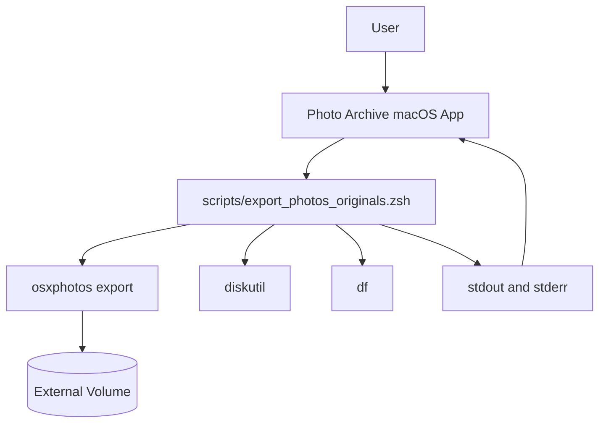
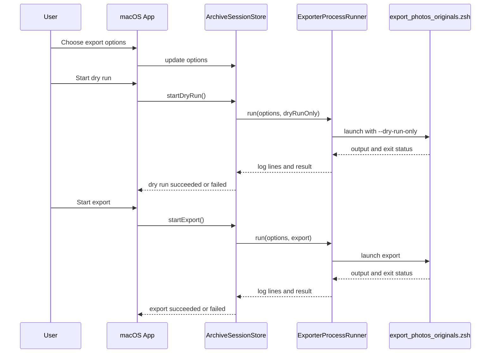
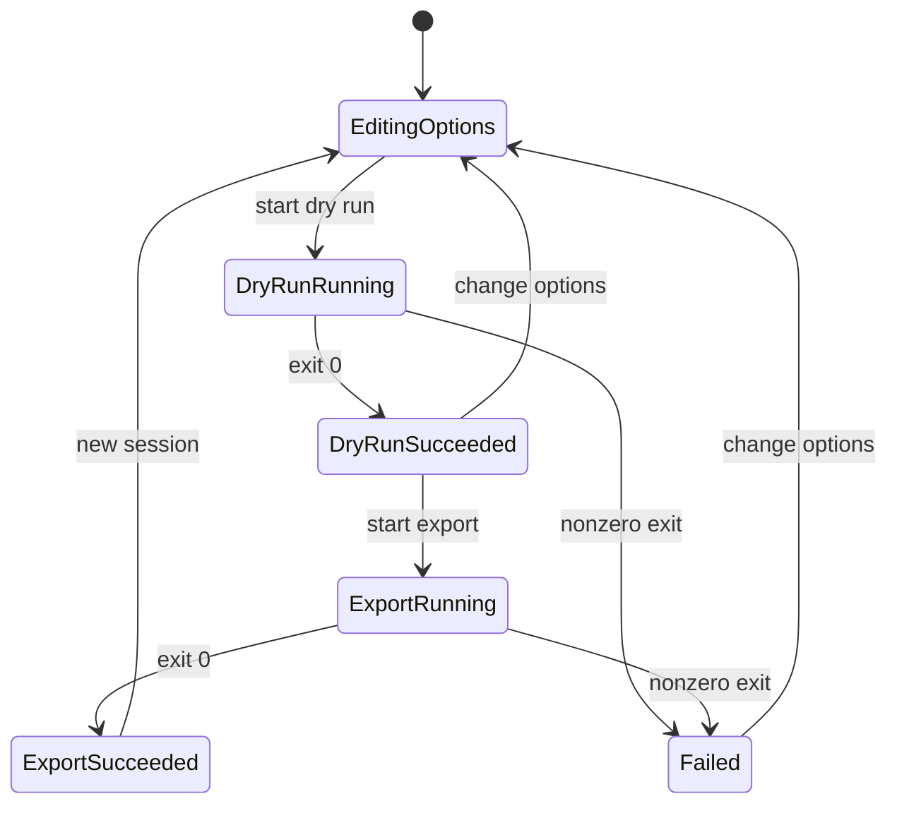
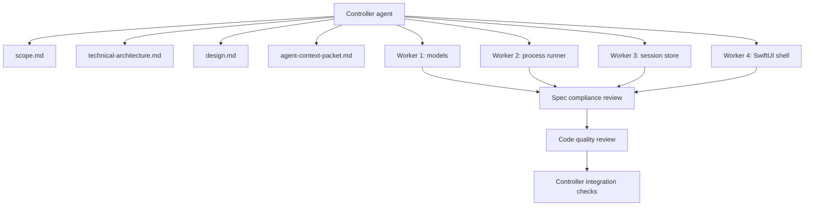

# macOS App POC Diagrams

## System Context

```mermaid
flowchart TB
  User[User] --> App[Photo Archive macOS App]
  App --> CLI[scripts/export_photos_originals.zsh]
  CLI --> OSXPhotos[osxphotos export]
  CLI --> Diskutil[diskutil]
  CLI --> DF[df]
  OSXPhotos --> Target[(External Volume)]
  CLI --> Output[stdout and stderr]
  Output --> App
```

## App Layers

```mermaid
flowchart LR
  subgraph UI[SwiftUI Views]
    ContentView
    SetupView
    RunView
    LogView
  end

  subgraph State[State and Models]
    ArchiveSessionStore
    ExportOptions
    ExportPhase
    ProcessLogLine
  end

  subgraph Services[Services]
    ExporterProcessRunner
    ScriptPathResolver
  end

  subgraph CLI[Existing CLI]
    ExportScript[export_photos_originals.zsh]
    ShellTests[export_photos_originals_test.zsh]
  end

  UI --> State
  State --> Services
  Services --> CLI
```

## User Flow

```mermaid
sequenceDiagram
  participant User
  participant App as macOS App
  participant Store as ArchiveSessionStore
  participant Runner as ExporterProcessRunner
  participant CLI as export_photos_originals.zsh

  User->>App: Choose export options
  App->>Store: update options
  User->>App: Start dry run
  App->>Store: startDryRun()
  Store->>Runner: run(options, dryRunOnly)
  Runner->>CLI: launch with --dry-run-only
  CLI-->>Runner: output and exit status
  Runner-->>Store: log lines and result
  Store-->>App: dry run succeeded or failed
  User->>App: Start export
  App->>Store: startExport()
  Store->>Runner: run(options, export)
  Runner->>CLI: launch export
  CLI-->>Runner: output and exit status
  Runner-->>Store: log lines and result
  Store-->>App: export succeeded or failed
```

## Session State

```mermaid
stateDiagram-v2
  [*] --> EditingOptions
  EditingOptions --> DryRunRunning: start dry run
  DryRunRunning --> DryRunSucceeded: exit 0
  DryRunRunning --> Failed: nonzero exit
  DryRunSucceeded --> ExportRunning: start export
  ExportRunning --> ExportSucceeded: exit 0
  ExportRunning --> Failed: nonzero exit
  Failed --> EditingOptions: change options
  DryRunSucceeded --> EditingOptions: change options
  ExportSucceeded --> EditingOptions: new session
```

## Agentic Development Flow

```mermaid
flowchart TB
  Controller[Controller agent] --> Scope[scope.md]
  Controller --> Architecture[technical-architecture.md]
  Controller --> Design[design.md]
  Controller --> Packet[agent-context-packet.md]
  Controller --> Worker1[Worker 1: models]
  Controller --> Worker2[Worker 2: process runner]
  Controller --> Worker3[Worker 3: session store]
  Controller --> Worker4[Worker 4: SwiftUI shell]
  Worker1 --> SpecReview[Spec compliance review]
  Worker2 --> SpecReview
  Worker3 --> SpecReview
  Worker4 --> SpecReview
  SpecReview --> QualityReview[Code quality review]
  QualityReview --> Integration[Controller integration checks]
```

