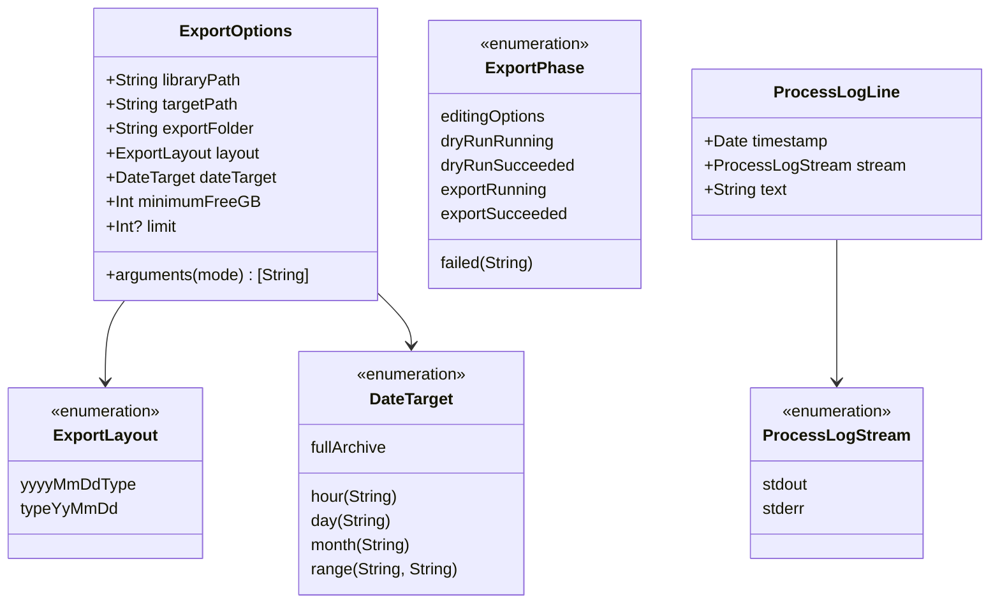
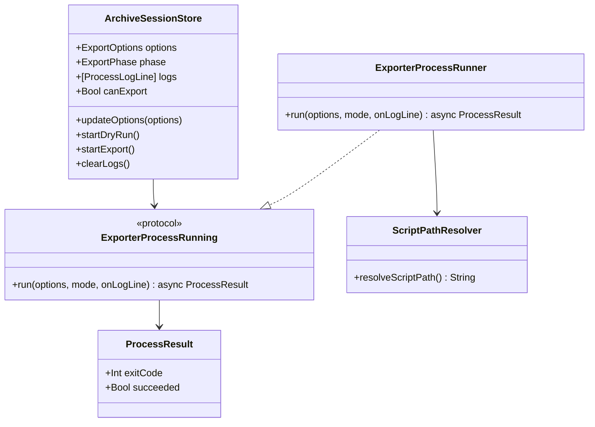
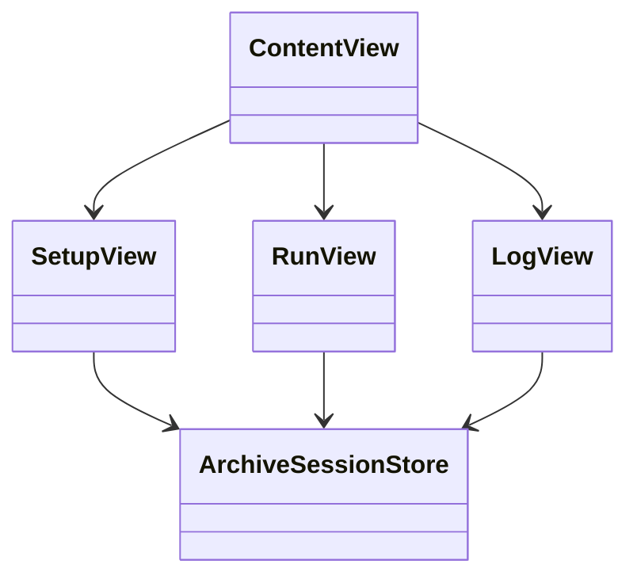

# macOS App POC UML

## Model Class Diagram

```mermaid
classDiagram
  class ExportOptions {
    +String libraryPath
    +String targetPath
    +String exportFolder
    +ExportLayout layout
    +DateTarget dateTarget
    +Int minimumFreeGB
    +Int? limit
    +arguments(mode) [String]
  }

  class ExportLayout {
    <<enumeration>>
    yyyyMmDdType
    typeYyMmDd
  }

  class DateTarget {
    <<enumeration>>
    fullArchive
    hour(String)
    day(String)
    month(String)
    range(String, String)
  }

  class ExportPhase {
    <<enumeration>>
    editingOptions
    dryRunRunning
    dryRunSucceeded
    exportRunning
    exportSucceeded
    failed(String)
  }

  class ProcessLogLine {
    +Date timestamp
    +ProcessLogStream stream
    +String text
  }

  class ProcessLogStream {
    <<enumeration>>
    stdout
    stderr
  }

  ExportOptions --> ExportLayout
  ExportOptions --> DateTarget
  ProcessLogLine --> ProcessLogStream
```

## Service Class Diagram

```mermaid
classDiagram
  class ArchiveSessionStore {
    +ExportOptions options
    +ExportPhase phase
    +[ProcessLogLine] logs
    +Bool canExport
    +updateOptions(options)
    +startDryRun()
    +startExport()
    +clearLogs()
  }

  class ExporterProcessRunning {
    <<protocol>>
    +run(options, mode, onLogLine) async ProcessResult
  }

  class ExporterProcessRunner {
    +run(options, mode, onLogLine) async ProcessResult
  }

  class ScriptPathResolver {
    +resolveScriptPath() String
  }

  class ProcessResult {
    +Int exitCode
    +Bool succeeded
  }

  ArchiveSessionStore --> ExporterProcessRunning
  ExporterProcessRunner ..|> ExporterProcessRunning
  ExporterProcessRunner --> ScriptPathResolver
  ExporterProcessRunning --> ProcessResult
```

## View Dependency Diagram

```mermaid
classDiagram
  class ContentView
  class SetupView
  class RunView
  class LogView
  class ArchiveSessionStore

  ContentView --> SetupView
  ContentView --> RunView
  ContentView --> LogView
  SetupView --> ArchiveSessionStore
  RunView --> ArchiveSessionStore
  LogView --> ArchiveSessionStore
```

